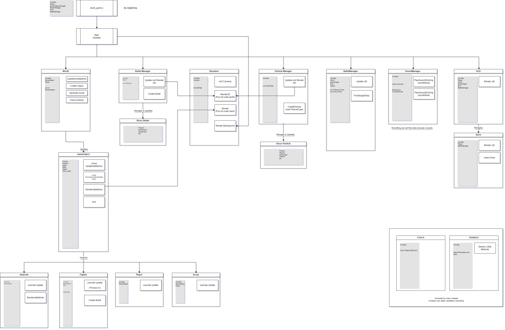
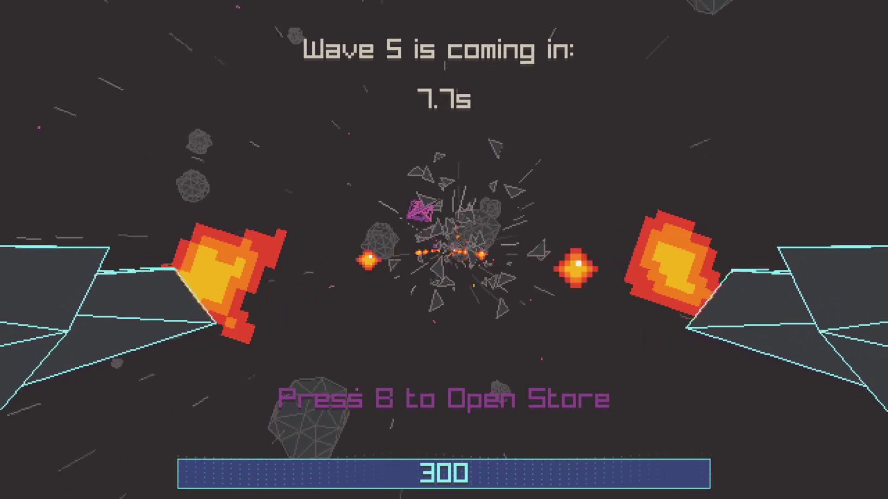
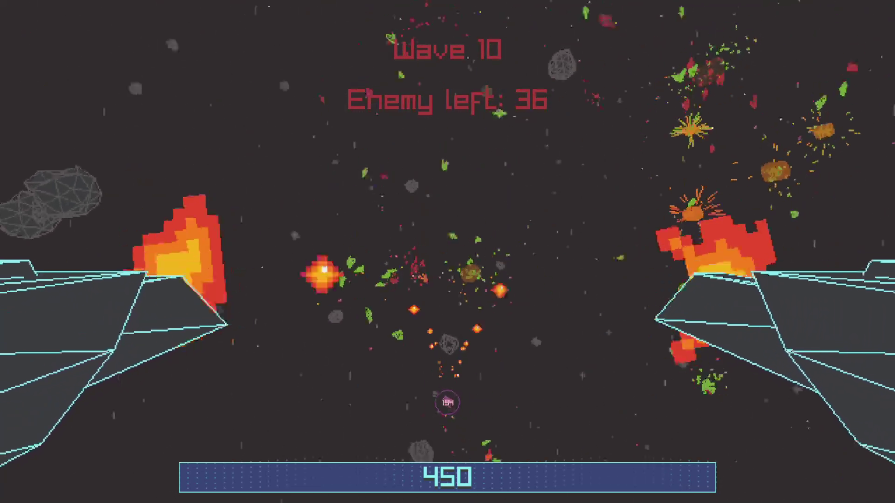

## AstroBlast 3D

")

### Description

Destroy asteroids, collect resources and upgrade your ship as you survive as long as you can against alien fleets!

Made by Wolderado (Salih Ünal)

### How To Play

Desktop located at: src/build/AstroBlast 3D/raylib_game.exe

Web: Play [HERE](https://wolderado.itch.io/astroblast-3d)

### Game Features

 - Epic 3D Space Battles
 - Juicy and Fun Animations
 - Ship Upgrading With Resource Collection
 - Hire Ally Ships Under Your Command
 - 8bit Arcade-y Sound FX
 
### Project Features

 - GameObject Management
 - Particle System (with pooling)
 - Spatial Partitioning For Optimized Collisions
 - Thousands Of Optimized Projectile Bullets
 - Responsive UI
 - Smooth LODs
 - Event System (Observer Pattern)
 - Game Time Management
 - Sound Management with 3D sounds
 - Finite State Machine (FSM) AI
 - First-Person Player Camera
 - Alpha Clip Shader
 - Windows & Web Ports
 
### Project Architecture

### Controls

 - Arrow Keys to Move
 - Left Shift to Thrust Forward
 - Left Control to Stop
 - Hold Space to Shoot
 - B to Open Shop (1,2,3,4,5 to Buy Item)
 - F to Fullscreen
 - M to Mute All sounds
 - ESC to Pause
 - F4 to Quit Game

### Screenshots

 
### Tools Used

 - Raylib
 - Clion
 - GitHub
 - ChipTone (for SFX)
 - Aseprite
 - GNU
 - Emscripten
 
 All assets are made by me

### Links

 - YouTube Gameplay: https://youtu.be/x07EK-_R3P0
 - itch.io Release: https://wolderado.itch.io/astroblast-3d

Copyright (c) 2024 Salih Ünal
